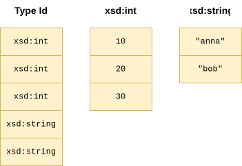
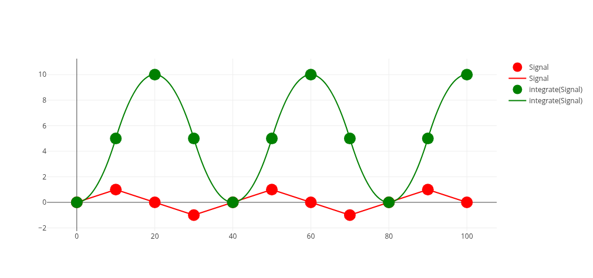

Today we've released [RDF Fusion 0.2.0](https://codeberg.org/tschwarzinger/rdf-fusion/releases) and our first blog post!
More than 10 months after our first release.
There are many changes included and some exciting things that lay groundwork for future features.
This blog post presents some highlights of the last months.

# Typed Families

RDF literals can store values of many data types (e.g., `xsd:integer`, `xsd:dateTime`).
In a relational query engine based on Arrow (such as DataFusion), we need to store these heterogenous values in homogenous arrays.
For example, the list `("10"^^xsd:int, "20"^^xsd:int, "30"^^xsd:int)` should be stored in an integer array,
while `("anna", "bob")` should be stored in a string array. 
Calculations like `add` and `sub` work on these representations instead of the lexical form.
This allows RDF Fusion to use the kernels of [arrow-rs](https://github.com/apache/arrow-rs) which often can make use of [SIMD](https://en.wikipedia.org/wiki/Single_instruction,_multiple_data) instructions.
One of our assumptions is that in real-world queries, literals bound to a variable tend to have the same data type (e.g., all integers) such that this scheme allows for efficient processing.
Currently, parsing is likely the largest bottleneck but we do have some plans for that.

In RDF Fusion 0.1.0 this was implemented using the *TypedValue* encoding, which had a large [`UnionArray`](https://arrow.apache.org/docs/format/Intro.html#union).
This approach is illustrated in the picture below (a bit simplified).
Each data type has a specialized array that holds the values and a discriminator decides which element is next in the array.

RDF Fusion 0.2.0 extends this approach to a *TypedFamily* encoding, where a set of data types are grouped together to a single family.
The `UnionArray`, instead of having a separate type id for all RDF data types, now only has a separate type id for each family.
The family itself can then choose how to encode the contained data types.
For example, strings are stored as a tuple of `(value, language)` instead of a union array or `xsd:string` and `rdf:langString`.
In the example above, the `xsd:int` would have been part of a `NumericFamily` which defines the encoding for numeric values.

A family is also responsible for implementing functions like pretty printing and sorting.
As a result, all data types within a family can have a custom comparator.
We use this to implement the sorting of numerical types (e.g., `"10"^^xsd:int` and `"10.0"^^xsd:float`).

The exciting thing about typed families is that they can provide an extension point.
Imagine an extension system where users can register, for example, a `TemperatureFamily` that can define semantically sensible sorting between °C and °F.
Although currently, RDF Fusion hard codes the set of supported families, we hope to open this system to support extensions.

# SPARQL Update Support

We now support SPARQL Update as well! 

# Parquet Support

Another big improvement over 0.1 is that RDF Fusion now can store RDF data persistently. 
But as Arrow and DataFusion have strong roots in the [OLAP](https://de.wikipedia.org/wiki/Online_Analytical_Processing) domain, they tend to use different file formats than we are usually seeing in RDF.
For these applications, [Parquet](https://parquet.apache.org/) is one of the most widely used file formats to store tabular data.
Therefore, we would also use these optimized implementations in RDF Fusion instead of building everything from scratch.

Using Parquet for storing RDF data is not really something unheard of.
For example, [Sempala](https://link.springer.com/chapter/10.1007/978-3-319-11964-9_11) and [S2RDF](https://arxiv.org/abs/1512.07021) already used Parquet for storing RDF data more than 10 years ago.
Recently, [COTTAS](https://link.springer.com/chapter/10.1007/978-3-032-09530-5_18) also investigated the use of Parquet by storing a large triple table instead of, for example, property tables.

We believe this is an interesting avenue for RDF data.
Not necessarily because of the compression but because Parquet is suitable for querying *remote files*.
Imagine, you want to share an RDF dataset with the world and upload a Parquet file that stores RDF data to a highly-available cloud object store.
No availability issues, no need for hosting compute resources.
Clients can query the Parquet files by loading Parquet's metadata and then downloading only the interesting data for a particular triple pattern.
Irrelevant parts of the file can be skipped using the [page index](https://parquet.apache.org/docs/file-format/pageindex/) and possibly Bloom filters.
We have started investigating this but it is still work-in-progress.
In the future, once we can compile RDF Fusion to [WebAssembly](https://webassembly.org/index.html), we hope to host a live demo where you can try this out.
Something akin to [Comunica's live demo](https://query.comunica.dev/).

We also have some thoughts about how we can improve the querying.
 
# DeltaQuads: Persistent Storage with Delta Lake

While Parquet allows storing RDF data dumps, building an RDF store on-top of a single standard Parquet file is quite inefficient.
Inserting a few quads will require rewriting the entire file.

We wanted to equip RDF Fusion with a working RDF storage layer that uses object storage for durable storage (again this comes from the OLAP background of DataFusion).
To address the limitation of a single Parquet file we chose [Delta Lake](https://delta.io/), an open [lakehouse framework](https://www.cidrdb.org/cidr2021/papers/cidr2021_paper17.pdf).
You can imagine this as a set of protocols and conventions such that applications can use the object store to create, update, and query tables (with transaction support!).
Simplifying a bit, applications can add new Parquet files to a table (adding rows) and remove old Parquet files from a table (removing rows).

However, usually, current RDF stores materialize multiple triple indexes with different sort orders so all kinds of triple patterns can be queried effectively.
Having a single Delta Lake table proved to be difficult to support this schema.
So we have designed a first version of *DeltaQuads*, again a set of protocols and standards that is designed for RDF data management in object stores.
DeltaQuads combines multiple Delta Lake tables in such a way that an RDF store can maintain multiple quad tables with different quad order permutations, similar to how traditional RDF stores store their indexes.
We implemented a first prototype in RDF Fusion 0.2.

Of course, using object storage comes with trade-offs compared to using local indexes.
For example, object stores introduce quite some latency.
We try to mitigate this with caching (Delta Lake never overwrites objects) and preloading metadata.

Nevertheless, the idea is that you can store your data in an object store and query it from possibly multiple query nodes.
If you want, you can even make your database publicly available and let clients query it directly as it's being updated!
Basically a fancy version of the Parquet approach discussed above.
We hope to integrate this as well into our live demo.
Again, this is work-in-progress.

# Larger than Memory RDF Term Dictionaries

The support for persistently storing DeltaQuads databases also gave the necessity that we might need to store dictionaries (mapping between integer ids and RDF terms) that are larger than the available main memory.
This is now possible with the help of [LMDB](https://en.wikipedia.org/wiki/Lightning_Memory-Mapped_Database) and [heed](https://docs.rs/heed/latest/heed/).
RDF Fusion can store these dictionaries in a local work folder (`RDF_FUSION_LOCAL_WORK_DIR`) and retain them on-disk.
When starting, RDF Fusion will check whether there are new entries in the global dictionary of the associated DeltaQuads database and add them to the local dictionary if necessary.
Note that you can avoid dealing with dictionaries if you store your RDF terms using, for example, the string encoding.

There are also ideas to provide a "traditional" storage backend for RDF Fusion based on LMDB. 

# What to expect from RDF Fusion 0.3

During the past months I've not been exclusively working on RDF Fusion.
My dissertation project involves investigating techniques for combining graph data (e.g., RDF) with time series data to support IoT use cases.
Often we find ourselves that we want to store a system's structure (e.g., the rooms of a building) and the relevant time series data (e.g., temperature readings) alongside each other.
In our research group, we tend to store the former as RDF graphs.
As RDF Fusion is based on technologies used for time series data management, we can process both types of data within the same query engine.
This was a large part of our motivation to use DataFusion for implementing SPARQL!
We've detailed some of these ideas in [RDF Fusion's publication](https://ieeexplore.ieee.org/abstract/document/11208525/).

For this purpose, I've been working on [PolyArrow](https://codeberg.org/tschwarzinger/poly-arrow) for a large part of the last 10 months.
PolyArrow is a library for encoding and processing signals (i.e., a function from time to data) based on Arrow and DataFusion.
PolyArrow supports multiple "signal types" (e.g., time series, linearly interpolated) and computation based on these signals like summation, integration, and differentiation.
The idea of using signals (and not just time series data) is that the query engine has a way of automatically resampling the signal when aligning multiple time series.
Ideally, the user can just state that, for example, the temperature in this room (signal A) should not deviate more than 2°C from the setpoint of this room (signal B) without worrying about alignment, sampling rates, etc.
And we get intuitive semantics for mathematical operations like integration, as you can see in the figure below.

We've discussed similar ideas in [SigSPARQL](https://ebooks.iospress.nl/volumearticle/74633), a query language that aims to integrate signals with RDF and SPARQL.
We hope to expand on these ideas in RDF Fusion 0.3 and provide a practically usable implementation of SigSPARQL, while still providing the same support for regular SPARQL queries.
Delta Lake and Parquet will be good friends when also storing time series data alongside our RDF graphs.

Furthermore, we hope that we can also improve upon the support for storing and querying RDF in Parquet and Delta Lake.
However, these improvements might need to wait until I've done the more urgent things surrounding my dissertation project.
We hope to release RDF Fusion 0.3 at the end of 2026 / beginning of 2027 (no promises).

If you want to discuss or collaborate anything of what we're doing here, don't hesitate to drop me an [e-mail](mailto:tobias.schwarzinger@tuwien.ac.at) or open an [issue](https://codeberg.org/tschwarzinger/rdf-fusion/issues).