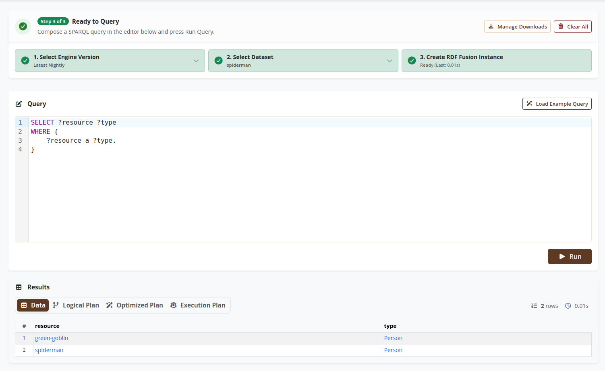

Today we've deployed the first version of the [RDF Fusion Playground](../playground)!
The playground provides you with the ability to execute queries using RDF Fusion directly in your browser.
Your queries (and your uploaded datatsets) do not leave your system.
The only server-side infrastructure involved (besides the website hosting) is a [Hetzner object storage](https://www.hetzner.com/storage/object-storage/) that we use to host the RDF Fusion Wasm builds and our dataset library.

Here is a screenshot when querying the [example dataset](https://www.w3.org/TR/turtle/#sec-intro) used in the Turtle specification:

Our playground currently can only query RDF data stored in [Parquet](https://parquet.apache.org/) files.
We host them in an S3-compatible object store at Hetzner.
For example, you can visit download a [Berlin SPARQL Benchmark](http://wbsg.informatik.uni-mannheim.de/bizer/berlinsparqlbenchmark/) dataset with 1000 products from <https://hel1.your-objectstorage.com/rdf-fusion-public/datasets/bsbm-1000/bsbm-1000-gpos.rdf.parquet>.
The query engine can directly query the files within the object store, ideally without downloading the entire file.

The querying is done in two steps:
1. First we download metadata from the Parquet files.
   This includes the footer and if available, the [Page Index](https://parquet.apache.org/docs/file-format/pageindex/) and any [Bloom filters](https://parquet.apache.org/docs/file-format/bloomfilter/).
   This data is then available for the query engine and can be used for evaluating multiple SPARQL queries.
2. Then, the query engine analyzes the query's triple patterns and uses the previously downloaded metadata for locating where relevant data is stored within a file.
   For example, given the triple pattern `?person <name> ?name`, the query engine tries to skip all parts of the file where a triple with the predicate `<name>` cannot be contained.
   Currently, this only works well if the sort order aligns with your triple patterns.
   In the example above, the file should be sorted first on `predicate`.
   We do have some ideas for improving the situation though in the future.

You can also download the files from the object stores.
Your browser will store the files in an [IndexedDb](https://developer.mozilla.org/en-US/docs/Web/API/IndexedDB_API), allowing you to issue queries without any further network interaction. 

# Future Improvements

We do have a few open issues related to our WebAssembly build and the Playground.
If you want to move any of these forward, feel free to let us know in the relevant issue!

- [Support Querying Triple Pattern Fragments #322](https://codeberg.org/tschwarzinger/rdf-fusion/issues/322)
- [Support Querying Multiple QuadStorages #323](https://codeberg.org/tschwarzinger/rdf-fusion/issues/323)
- [Support Querying DeltaQuads Tables in Wasm #324](https://codeberg.org/tschwarzinger/rdf-fusion/issues/324)
- [Allow UNION Queries in Playground #325](https://codeberg.org/tschwarzinger/rdf-fusion/issues/325)
- [Allow Converting Traditional RDF Files to Parquet in the Playground ](https://codeberg.org/tschwarzinger/rdf-fusion/issues/326)
- [Allow Users to Download Locally-Available Parquet Files in the Browser #327](https://codeberg.org/tschwarzinger/rdf-fusion/issues/327)
- [Enable Spilling in Playground #329](https://codeberg.org/tschwarzinger/rdf-fusion/issues/329)

# Feedback or Found a Bug?

Please open an [issue](https://codeberg.org/tschwarzinger/rdf-fusion/issues) and we can discuss how we can improve RDF Fusion and its playground.